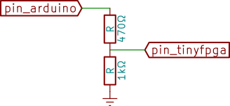
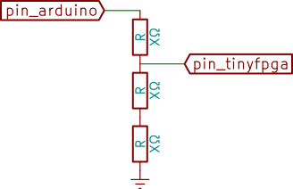
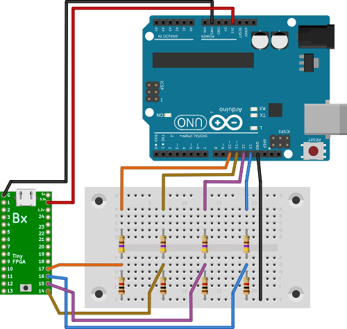

# Programming with an Arduino

Programming the TinyFPGA using an Arduino (or compatible board) is useful in
the following cases:

 * You have overridden the TinyFPGA bootloader, so you cannot program the board
   any more and need a way to upload the bootloader again.

 * You have a project that needs a lot data to be stored in the Flash memory,
   and leaving the bootloader there takes too much place. In that case, simply
   upload your bitstream at the address `0` and you are free to use the
   remaining space.

## Hardware

:warning: **The TinyFPGA board is expecting 3.3V, but the Arduino board is
typically outputting 5V! We explain below how to go from 5V to 3.3V.**
:warning:

The following connections will be made:

| Arduino pin | TinyFPGA pin | Comment                      |
| :---------: | :----------: | :--------------------------: |
| 3.3V        | 3.3V         |                              |
| GND         | G            |                              |
| 10          | 17           | Through 5V-to-3.3V converter |
| 11          | 14           | Through 5V-to-3.3V converter |
| 12          | 15           | Through 5V-to-3.3V converter |
| 13          | 16           | Through 5V-to-3.3V converter |

To convert from 5V to 3.3V, a solution is to use a [voltage
divider](https://en.wikipedia.org/wiki/Voltage_divider) made of a few
resistors. By using `R1=470Ω` and `R2=1kΩ`, we should have an output close to
3.4V, which should be good:

If you don't have those specific resistor values, just take the same value
three times, the output should be close to 3.3V:

The following shows all connections between the two boards:

:warning: The TinyFPGA USB port should not be plugged at all at that point,
you can plug the Arduino board instead. :warning:

## Uploading the Arduino bootloader with PlatformIO

[PlatformIO](http://platformio.org/) is an open source ecosystem that make
using Arduino and other boards a breathe.

Once installed on your system, start by initialising the project from this
directory  (using the Arduino UNO board as an example):

    $ platformio init --board uno

Then, build the project and upload it to your Arduino:

    $ platformio run --target upload

That's all!

## Using the Arduino to program the TinyFPGA

We are going to use [the programmer CLI](../programmer).

First, find the vendor and product ID of your Arduino board. Doing so depends
on your operating system. For example on GNU/Linux:

    $ lsusb
    --<snip>--
    Bus 001 Device 002: ID 2341:0001 Arduino SA Uno (CDC ACM)
    --<snip>--

Now, use that vendor-product ID to program the Flash via the Arduino:

    $ ../programmer/tinyfpgab.py -d 2341:0001 -a 0 -p /snip/bootloader.bin

Notice the following in the command above:

 * The `-d` parameter specifies the device ID (vendor:product)
 * The `-a` parameter gives the address at which to program the bitstream: here
   we are writing at address 0, which is the correct address to put the
   TinyFPGA bootloader at.

Depending on the bitstream run by the FPGA, you may need to do the following:

 * Disconnect the Arduino from your computer, plug it back, and try again
 * Do the same, but this time press the reset button once before programming
 * Do the same, but this time hold the reset button before programming and
   *during the whole programming operation*: it is likely to last a minute or
   two, so be patient or use some non-metallic tool to hold the reset button
   down (a wooden clothes peg seems to do the job)
